# Filter images

Remove corrupt and non-brain images from `data/FOMO300K_images`.

```bash
uv run python experiments/filter_images/index_metadata.py  # data/FOMO300K_images/metadata.parquet
uv run python experiments/filter_images/plot_summary.py    # figures/summary/
uv run python experiments/filter_images/filter_images.py   # filter.parquet, filelist_filtered.txt
uv run python experiments/filter_images/plot_montages.py   # figures/montages/
```

| Rule | Catches | Excluded |
|---|---|---|
| `adc_map`: bval1000 with 99.5% quantile < 1 | ADC-like maps labeled bval1000 | 6,374 |
| `partial_coverage`: mask extent < 100 mm on any axis | thin slabs, neck/spine scans | 4,379 |
| `bad_mask`: mask > 75% of volume | noisy background in mask | 76 more |

**Kept 88,225 / 98,820 images (306 GB).** No corrupt images in 300 random kept images; a few percent are low quality but valid.

**Excluded `adc_map`**

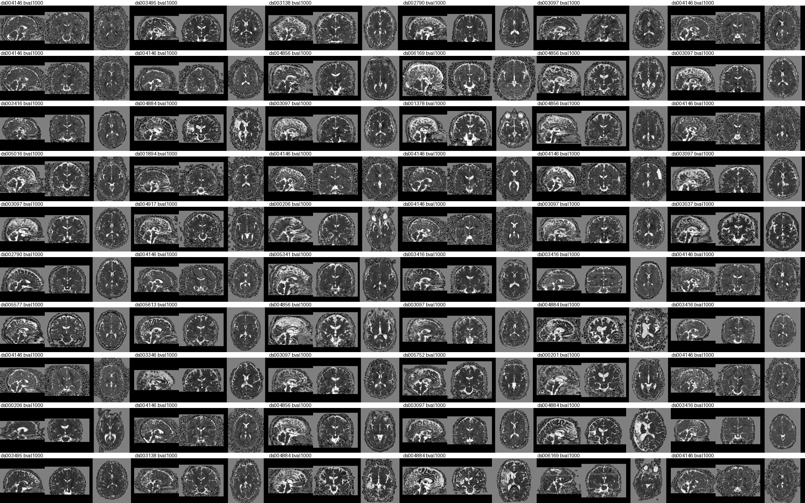

**Excluded `partial_coverage`**

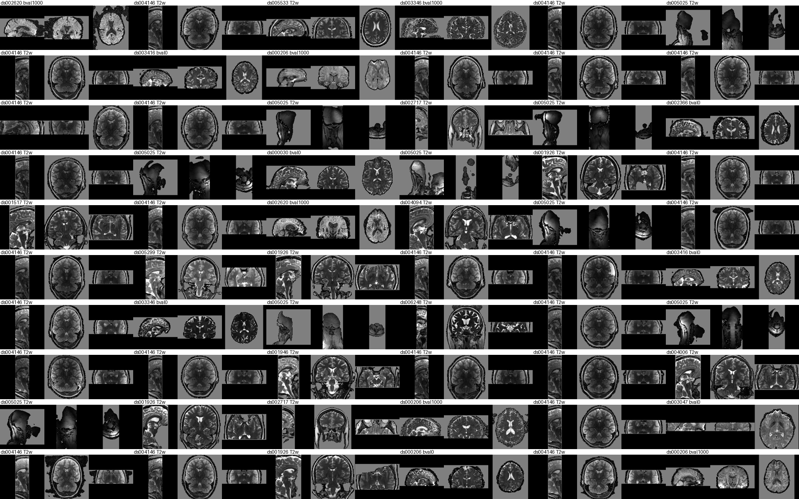

**Random kept**

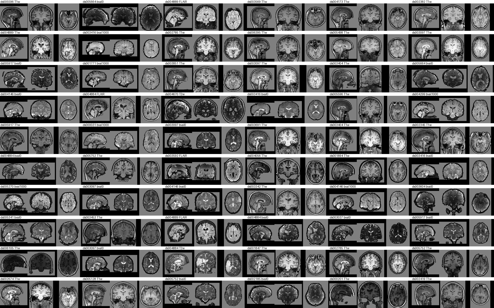

## Summary plots (before filtering)

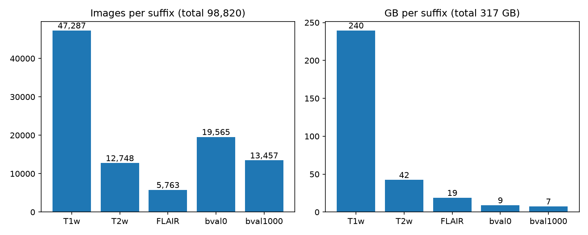

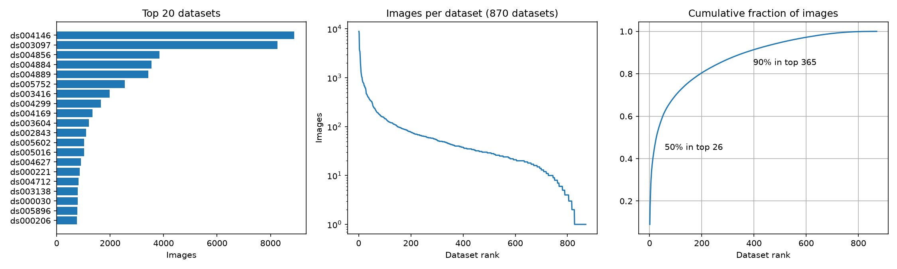

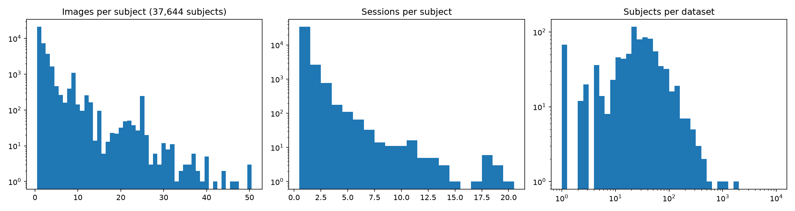

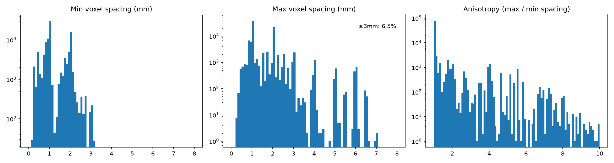

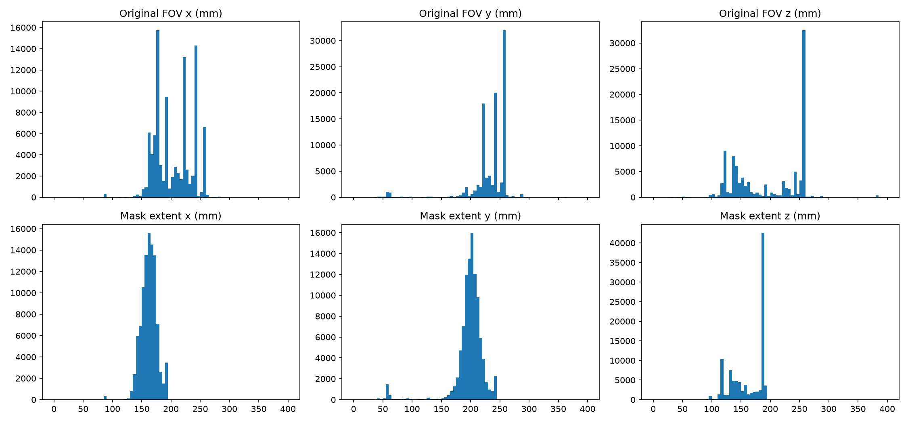

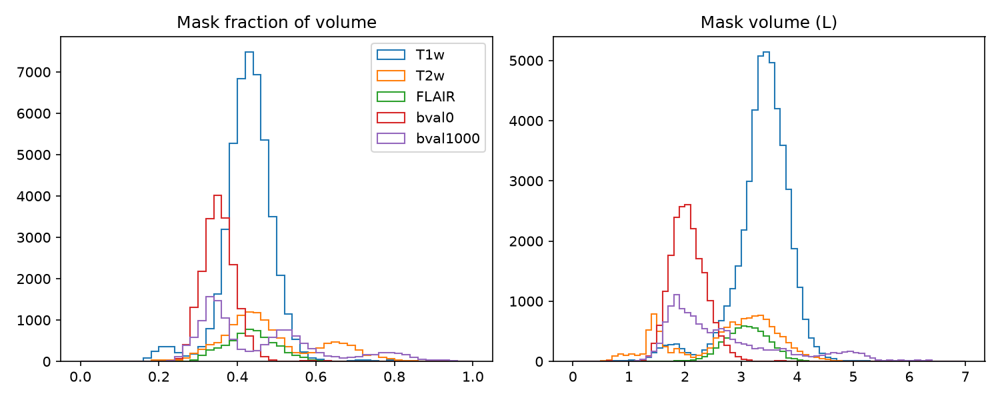

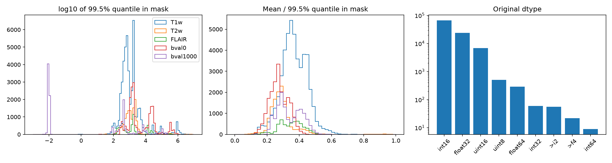

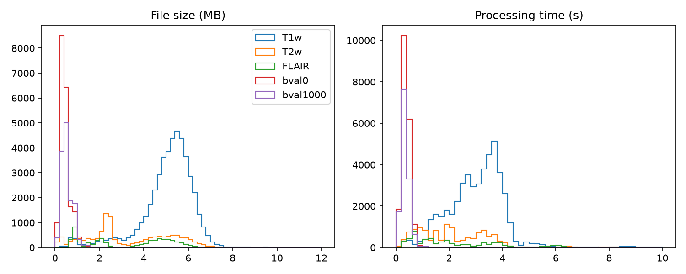
