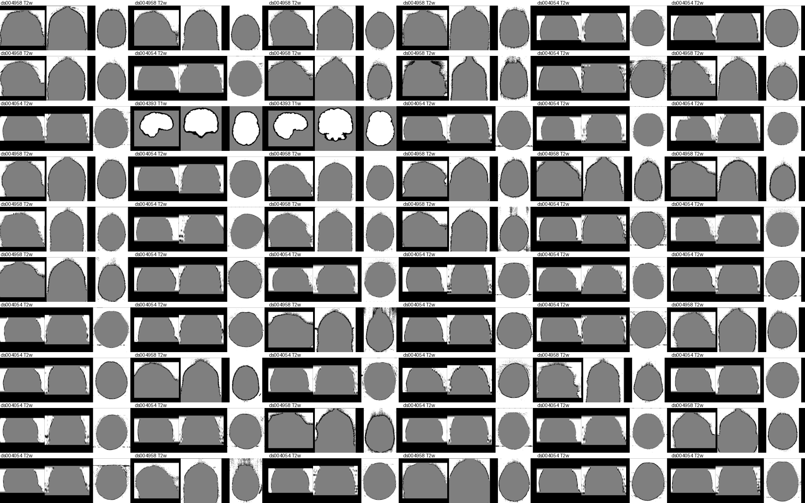
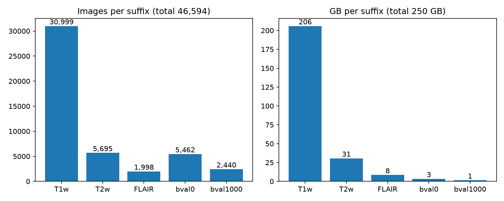
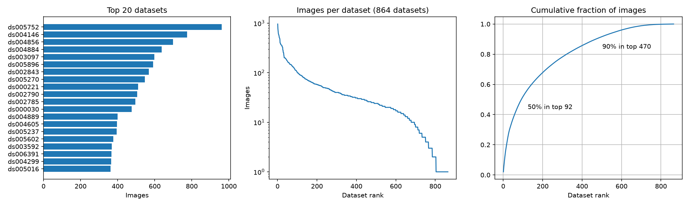
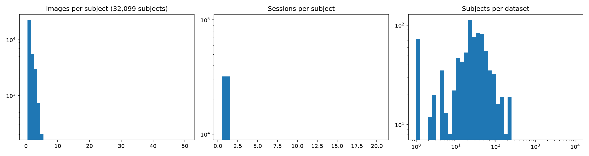

# Filter images

Remove corrupt and non-brain images from `data/FOMO300K_images`, then keep one image per suffix.
Subject and session subsampling happens upstream in `experiments/subsample_sessions/`.

## Summary

```bash
uv run python experiments/filter_images/index_metadata.py  # data/FOMO300K_images/metadata.parquet
uv run python experiments/filter_images/plot_summary.py    # figures/summary/
```


## Filtering

```bash
uv run python experiments/filter_images/filter_images.py   # filter.parquet, filelist_filtered.txt
uv run python experiments/filter_images/plot_montages.py   # figures/montages/
```

| Rule | Catches | Excluded | Only this rule |
|---|---|---|---|
| `adc_map`: bval1000 with 99.5% quantile < 1 | ADC-like maps labeled bval1000 | 2,742 | 2,213 |
| `partial_coverage`: mask extent < 100 mm on any axis | thin slabs, neck/spine scans | 2,579 | 2,139 |
| `bad_mask`: mask > 75% of volume | noisy background in mask | 754 | 36 |
| `low_contrast`: (p90 - p10) / median < 0.65 in mask | flat images, phantoms | 183 | 88 |
| `saturated`: median / 99.5% quantile > 0.9 | inverted masks on phantoms, clipped images | 77 | 24 |

**Kept 54,676 / 60,079 images (278 GB).**

**Excluded `adc_map`**


**Excluded `partial_coverage`**


**Excluded `low_contrast`**


**Excluded `saturated`**



**Random kept**


## Subsampling

```bash
uv run python experiments/filter_images/subsample_images.py  # subsample.parquet, filelist_subsampled.txt
uv run python experiments/filter_images/plot_subsample.py    # figures/subsample/
```

Keep the first image per suffix in each session.

| Stage | Images | Subjects | GB |
|---|---|---|---|
| Filtered | 54,676 | 32,099 | 278 |
| One image per suffix | 46,594 | 32,099 | 250 |

Final: T1w 30,999, T2w 5,695, FLAIR 1,998, bval0 5,462, bval1000 2,440. Filtering drops 710 of the
32,809 subjects in the split entirely, and 16 of 880 datasets.






