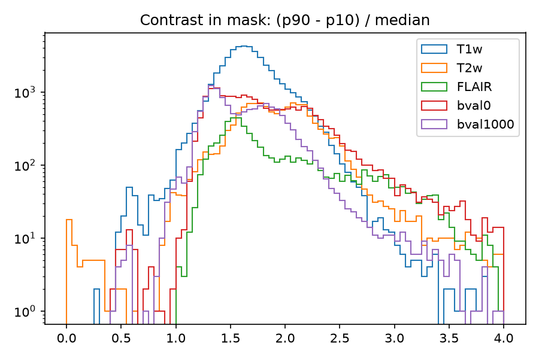
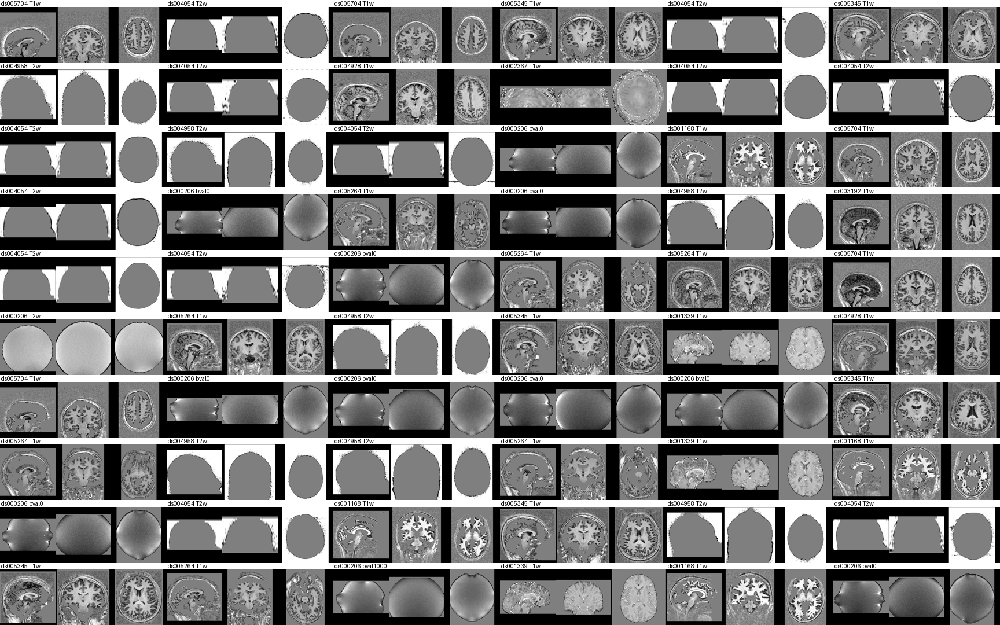

# Filter images

Remove corrupt and non-brain images from `data/FOMO300K_images`.

## Summary

```bash
uv run python experiments/filter_images/index_metadata.py  # data/FOMO300K_images/metadata.parquet
uv run python experiments/filter_images/plot_summary.py    # figures/summary/
```





## Filtering

```bash
uv run python experiments/filter_images/filter_images.py   # filter.parquet, filelist_filtered.txt
uv run python experiments/filter_images/plot_montages.py   # figures/montages/
```

| Rule | Catches | Excluded | Only this rule |
|---|---|---|---|
| `adc_map`: bval1000 with 99.5% quantile < 1 | ADC-like maps labeled bval1000 | 6,374 | 5,075 |
| `partial_coverage`: mask extent < 100 mm on any axis | thin slabs, neck/spine scans | 4,379 | 3,774 |
| `bad_mask`: mask > 75% of volume | noisy background in mask | 1,522 | 38 |
| `low_contrast`: (p90 - p10) / median < 0.65 in mask | flat images, phantoms | 234 | 176 |

**Kept 88,049 / 98,820 images (305 GB).** No corrupt images in 300 random kept images; a few percent are low quality but valid.

**Excluded `adc_map`**


**Excluded `partial_coverage`**


**Excluded `low_contrast`**



**Random kept**


## Subsampling

```bash
uv run python experiments/filter_images/subsample_images.py  # subsample.parquet, filelist_subsampled.txt
```

Keep the first image per (subject, suffix), then at most 200 random subjects per dataset.

| Stage | Images | Subjects | GB |
|---|---|---|---|
| Filtered | 88,049 | 37,487 | 305 |
| One per (subject, suffix) | 58,580 | 37,487 | 231 |
| ≤200 subjects per dataset | 47,837 | 32,361 | 195 |

The cap cuts FLAIR the most (4.6K to 2.0K), since 58% of FLAIR images come from three datasets.
